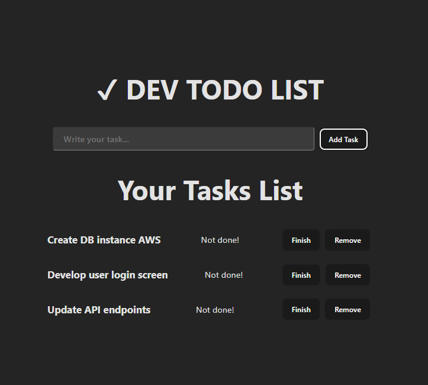

<h1 align="center"> React To Do List</h1>

  <a href="#-technologies">Technologies</a>&nbsp;&nbsp;&nbsp;|&nbsp;&nbsp;&nbsp;
  <a href="#-project">Project</a>&nbsp;&nbsp;&nbsp;|&nbsp;&nbsp;&nbsp;
  <a href="#-layout">Layout</a>&nbsp;&nbsp;&nbsp;|&nbsp;&nbsp;&nbsp;

 

  

## 🚀 Technologies

- JavaScript
- React

## 💻 Project

The project is a small to do list.

## 🔖 Layout

The application layout it's a simple and organized interface.

---